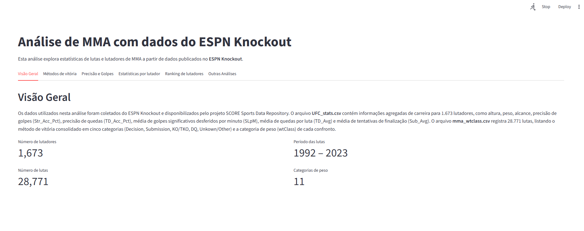
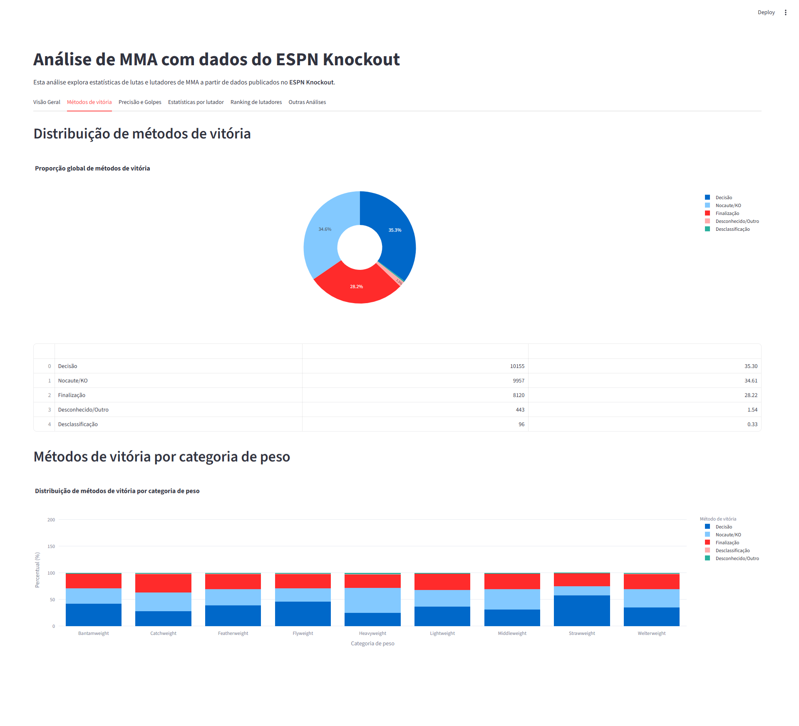
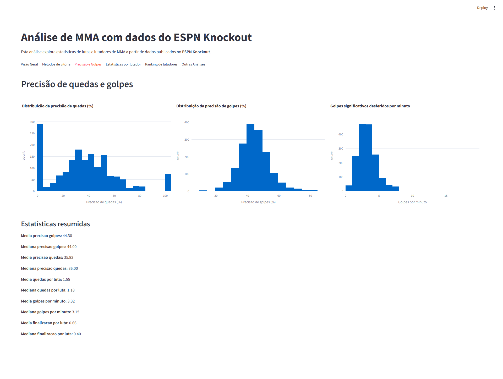
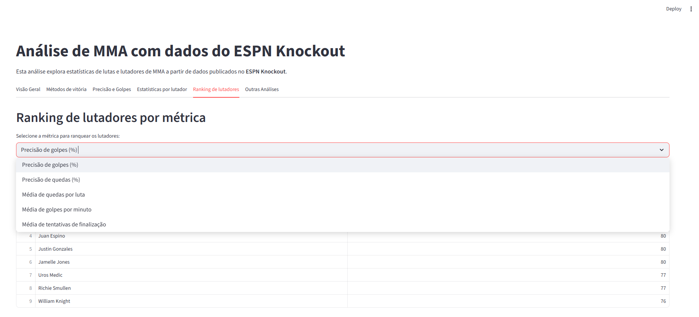
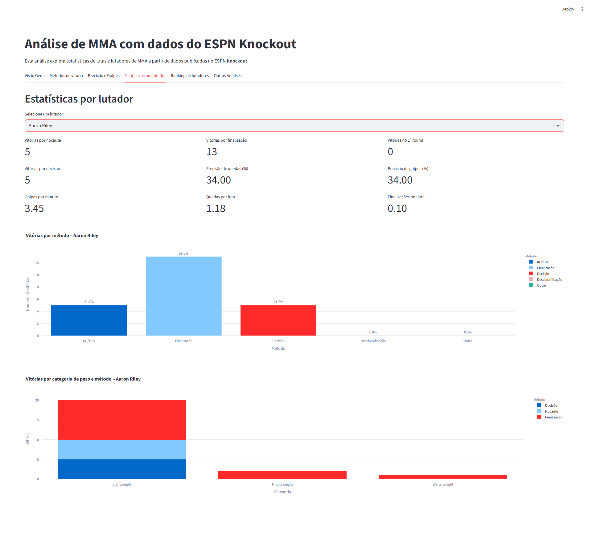
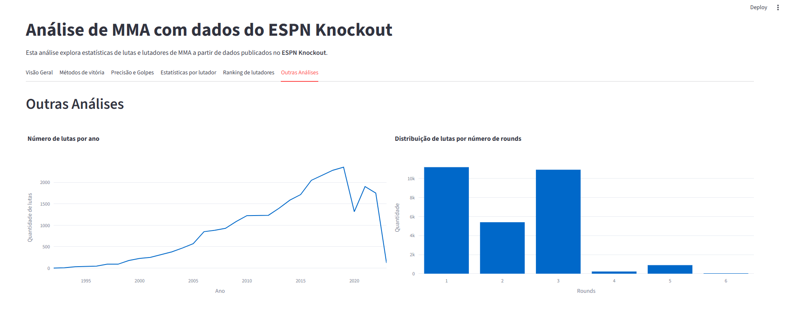

# Case CT Barreto - Análise de MMA com dados do ESPN Knockout

Este projeto apresenta uma análise exploratória e interativa de dados de
artes marciais mistas (MMA) a partir de conjuntos de dados derivados do
**ESPN Knockout** e disponibilizados pelo repositório de dados do
**SCORE Sports Data Repository**. 

> O objetivo é fornecer uma visão detalhada sobre métodos de vitória, distribuição por categorias de peso, precisão de golpes e quedas, além de estatísticas agregadas dos lutadores para integrar Workshops do **Centro de Treinamento Barreto.**

### Descrição dos dados

Os dados foram coletados de páginas do ESPN e do MMADecisions e
compilados pelo projeto SCORE Network. Os arquivos principais são:

- **UFC_stats.csv** – contém 1.673 lutadores, com colunas de altura,
  peso, alcance, postura, ano de nascimento e estatísticas de golpes e
  quedas. As principais métricas utilizadas são:
  - `SLpM`: Golpes significativos desferidos por minuto.
  - `Str_Acc_Pct`: Precisão de golpes (em %).
  - `SApM`: Golpes significativos recebidos por minuto.
  - `Str_Def_Pct`: Defesa de golpes (em %).
  - `TD_Avg`: Média de quedas por luta.
  - `TD_Acc_Pct`: Precisão de quedas (em %).
  - `TD_Def_Pct`: Defesa de quedas (em %).
  - `Sub_Avg`: Média de tentativas de finalização por luta.

- **mma_wtclass.csv** – descreve 28.771 lutas, incluindo data, evento,
  se valia cinturão, tempo da luta e, principalmente, a coluna
  `decision_group` que agrega o método de vitória em cinco categorias:
  *Decision*, *Submission*, *KO/TKO*, *DQ* e *Unkown/Other*.  A
  coluna `wtClass` indica a categoria de peso de cada combate. Este
  conjunto de dados permite verificar se lutas de categorias mais
  leves tendem a terminar por decisão, como sugerido na página
  original.

- **mma_decisions.csv** – inclui detalhes de pontuações dos juízes em
  lutas que terminaram em decisão, mas não é utilizado diretamente
  nesta análise.


## Como executar

#### 1. Requisitos
- **Python 3.12+** instalado
- Bibliotecas: `numpy`, `pandas`, `matplotlib`, `plotly`, `seaborn`, `streamlit`


```bash
# Sincronize as deps do projeto
uv sync
```

```bash
# Inicie a aplicação Streamlit
streamlit run app/streamlit_app.py
```

## Métricas e KPIs utilizados

### Distribuição de métodos de vitória

Utilizamos a coluna `decision_group` de `mma_wtclass.csv` para
calcular a porcentagem de lutas que terminaram por **Decisão**,
**Finalização (Submission)**, **Nocaute ou Nocaute Técnico (KO/TKO)**,
**Desclassificação (DQ)** e **Desconhecido/Outro**. Esses percentuais
permitem avaliar a prevalência de cada método no universo de 28.771
lutas.



### Métodos de vitória por categoria de peso

Agrupamos as lutas por `wtClass` e `decision_group` para analisar se
determinadas categorias de peso têm maior tendência a irem até a
decisão ou terminarem em nocaute/finalização. A ordem das categorias
apresentadas segue uma progressão aproximada dos pesos: da mais leve
(*Strawweight*) à mais pesada (*Heavyweight*), incluindo lutas
*Catchweight*.



### Precisão de golpes e quedas

No conjunto `UFC_stats.csv` avaliamos:

- **Precisão de golpes (Str_Acc_Pct)** – porcentagem de golpes
  significativos desferidos que acertaram o adversário;
- **Precisão de quedas (TD_Acc_Pct)** – porcentagem de tentativas de
  queda bem‑sucedidas;
- **Média de golpes por minuto (SLpM)** – quantifica o volume
  ofensivo do lutador;
- **Média de quedas por luta (TD_Avg)** e **média de tentativas de
  finalização (Sub_Avg)** – indicadores de grappling.

Essas métricas são apresentadas em histogramas que mostram a
distribuição entre todos os lutadores.



### Rankings de lutadores por métrica

Permite selecionar uma métrica e listar os 10 lutadores com melhor
desempenho. As métricas disponíveis são: precisão de golpes, precisão
de quedas, média de quedas por luta, média de golpes por minuto e
média de tentativas de finalização.



### Estatísticas por lutador

 O painel **“Estatísticas por lutador”** foi aprimorado para espelhar o estilo
 das visualizações do ESPN KnockOut. Ao escolher um atleta, a
 aplicação calcula uma série de métricas agregadas a partir dos dados
 de lutas e das estatísticas de carreira:

 - **Total de lutas e vitórias** – total de lutas registradas no
   conjunto e quantas destas terminaram em vitória.
 - **Vitórias por método** – contagem de vitórias por nocaute/KO,
   finalização, decisão dos juízes, desclassificação e outras.
 - **Vitórias no 1º round** – quantas lutas foram encerradas ainda no
   primeiro assalto.
 - **Porcentagens** – percentuais que cada método representa dentro
   do total de vitórias do atleta.
 - **Precisões e médias** – incorpora métricas de carreira, como
   precisão de quedas, precisão de golpes, média de golpes por
   minuto (SLpM), média de quedas por luta (TD_Avg) e média de
   tentativas de finalização (Sub_Avg), extraídas de
   `UFC_stats.csv`.

 Esses indicadores são apresentados em cartões numéricos e gráficos de
 barras. O primeiro gráfico mostra a distribuição das vitórias por
 método para o lutador selecionado. O segundo gráfico agrupa as
 vitórias por categoria de peso e método de vitória, permitindo
 visualizar, por exemplo, se o atleta nocauteou mais em uma divisão
 específica ou se suas vitórias por decisão concentram‑se em outra
 categoria. A abordagem se inspira nos dashboards exibidos em
 transmissões do ESPN KnockOut, priorizando clareza visual e
 percentuais destacados.

 

### Outras análises

- **Lutas por ano** – contagem de lutas em cada ano do intervalo
  analisado (1993–2024). Isso ajuda a visualizar a evolução do volume
  de eventos de MMA ao longo do tempo.
- **Distribuição de lutas por número de rounds** – mostra quantas lutas
  terminaram no primeiro, segundo, terceiro etc. rounds. Lutas
  programadas para cinco rounds (eventos principais ou lutas por
  cinturão) costumam apresentar distribuições distintas das lutas de
  três rounds.



## Possíveis Melhorias

Vou implementar(eu acho):

- Integrar dados de minutagem das lutas para calcular a taxa real de
  golpes totais ou quedas por luta;
- Desenvolver modelos preditivos para prever o método de vitória
  baseado na categoria de peso e nos atributos dos lutadores;
- Explorar o conjunto `mma_decisions.csv` para avaliar o grau de
  concordância entre os juízes e identificar possíveis vieses.

---

### 🤝 Contribuindo

Contribuições são bem-vindas! Se você quiser sugerir melhorias ou adicionar novo conteúdo:

1. Faça um fork do repositório
2. Crie uma nova branch
3. Envie um pull request
4. Abra uma issue [issue](../../issues) para discussões
---

### 🔄 Status do Projeto


--- 

### Entre em contato
  
<a href="https://linkedin.com/in/danielnunesdc" target="blank"></a>
</p><br />

---
### Licença 

Esse projeto está sob a licença MIT. Para mais detalhes acesse [LICENSE](LICENSE.md).

--- 
*Nota: Este repositório é destinado apenas para fins de Treinamentos educacionais e de pesquisa.*

---

Made with :coffee: and ♥ by Daniel Nunes :wave: